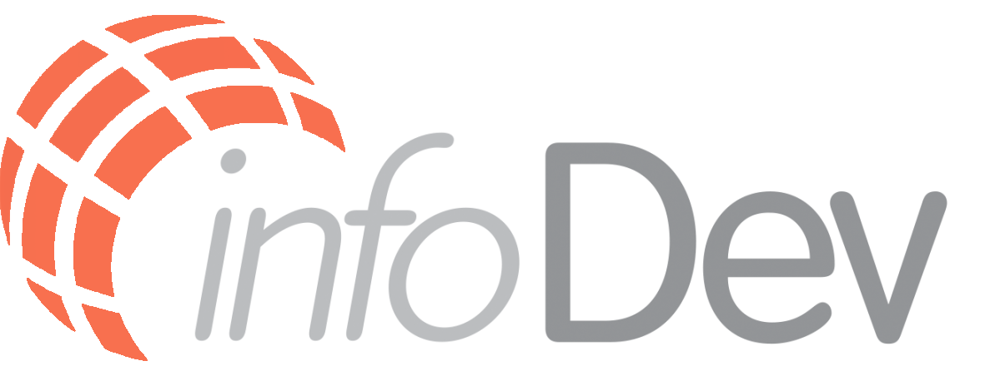

<p align="center">


&#xa0;
  
    
  
  
  
</p>

&#xa0;

<h4 align="center"> 
	🚧  Em construção...  🚧
</h4> 

&#xa0;

<p align="center">
  <a href="https://www.figma.com/file/IkWuJViU7BSWwdWgzydQsG/InfoDev">Layout</a> &#xa0; | &#xa0;
  <a href="#rocket-tecnologias">Tecnologias</a> &#xa0; | &#xa0;
  <a href="#checkered_flag-começando">Começando</a> &#xa0;  | &#xa0;
  <a href="#memo-licença">Licença</a> &#xa0 
</p>

<p align="center">
    Projeto desenvolvido pelo grupo 10 durante o curso Desenvolvimento Web Fullstack  (Digital House)
    <br />    
  </p>

## :dart: Sobre o Projeto
<br>
Se você é apaixonado por tecnologia, está no lugar certo! Você é HighTech? Nós somos. É gamer? Nós também! Você é Hardware? Esse é nosso DNA! Nascemos assim, 100% conectados. Esta plataforma foi criada para trazer os melhores produtos para você, apaixonado por tecnologia e games este é o seu lugar!

<p align="right">(<a href="#top">voltar ao topo</a>)</p>

## :rocket: Tecnologias

As seguintes ferramentas foram usadas durante a construção do projeto:
&#xa0;

- [HTML5]()
- [CSS3]()
- [EJS]()
- [NodeJs](https://nodejs.org/en/)
- [React.js](https://reactjs.org/)
- [Next.js](https://nextjs.org/)
- [Express Js](https://expressjs.com/)
- [MySQL](https://www.mysql.com)
- [Sequelize ORM](https://sequelize.org)


<p align="right">(<a href="#top">voltar ao topo</a>)</p>

## :checkered_flag: Começando

Antes de começar :checkered_flag:, você precisa ter o [Git](https://git-scm.com) e o [Node](https://nodejs.org/en/) instalados em sua maquina.

```bash
# Clone este repositório
$ git clone https://github.com/junglereef/InfoDev

# Entre na pasta
$ cd infodev

# Instale as dependências
$ npm install

# Para iniciar o projeto
$ npm run dev

# O app vai inicializar em <http://localhost:3000>
```

<p align="right">(<a href="#top">voltar ao topo</a>)</p>

<!-- LICENSE -->

## :memo: Licença

MIT License - Project Link: [https://github.com/junglereef/InfoDev/blob/main/LICENSE.md](https://github.com/junglereef/InfoDev/blob/main/LICENSE.md)

<p align="right">(<a href="#top">voltar ao topo</a>)</p>
